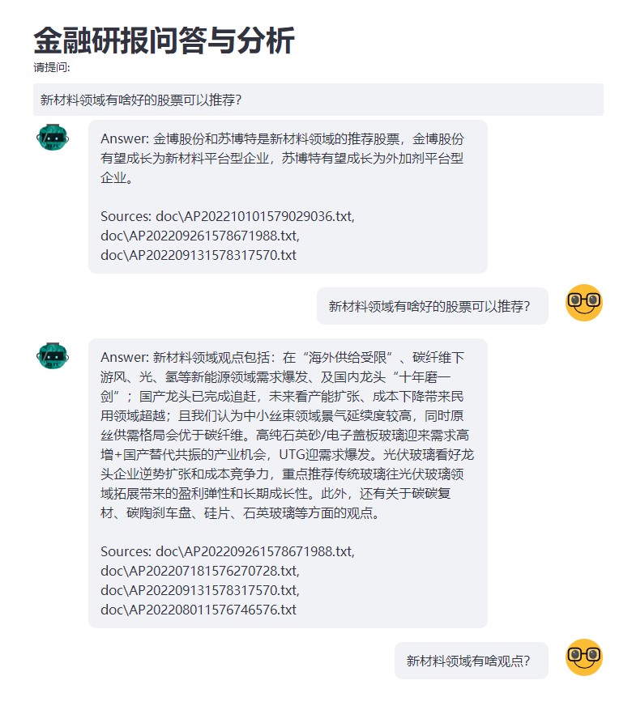

# 金融研报分析小助手

金融打工人的福利来了，最近以chatgpt为代表的大语言模型特别火，我这里提供一个构建自己的金融研报分析问答系统的样例程序，让每个金融打工人都可以轻松拥有自己的研报分析小助手。本程序利用chatgpt强大的自然语言理解和生成能力，接入自己的金融研报知识库，帮助金融分析师更好地分析和理解金融数据，并且提供更加个性化的研究报告和问答服务。

## 项目文件说明

文件名称|说明
------|:--:
ingest.py|本程序主要用于读取指定目录下所有研报文本,建立索引.|
qa_test.py|本程序用于测试针对研报知识库的问答是否正常.|
web.py|本程序提供一个web交互界面给用户进行提问.|
doc目录|此文件夹里保存了用于建立知识库的一些研报样本.|
.env文件|此文件用于记录openai的API_KEY.|


### 首先安装依赖

```shell
pip install -r requirements.txt
```

我的测试环境是windows11和python310


### 配置openai的API_KEY

本程序利用了dotenv库加载环境变量,需要把你自己的API_KEY配置在.env文件中

```shell
OPENAI_API_KEY=sk-xxx
```


### 建立知识库

你可以整理好你自己的研报文本,放入doc目录, 运行下面命令:

```shell
python ingest.py
```


### 测试知识库

当知识库建立完毕后,可以尝试测试提问是否正常, 比如类似如下命令:

```shell
python qa_test.py "新材料领域有啥观点？"
```


### 启动WEB交互界面

测试没问题后,就可以启动WEB服务并打开WEB界面进行交互了. 命令如下:

```shell
streamlit run web.py
```

演示效果图:


